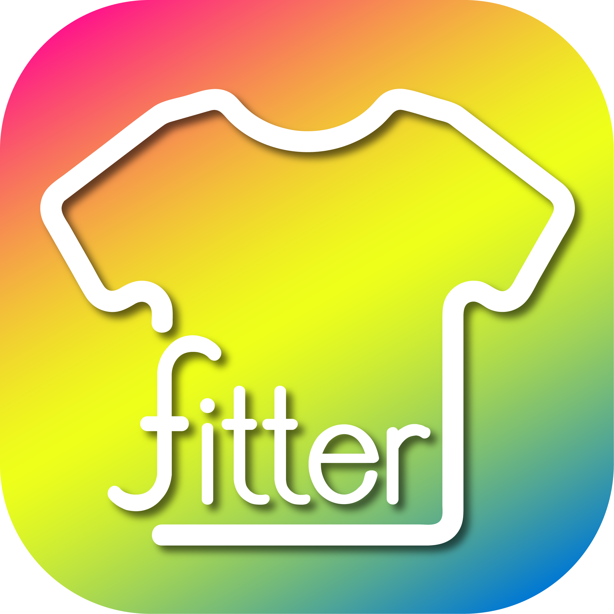
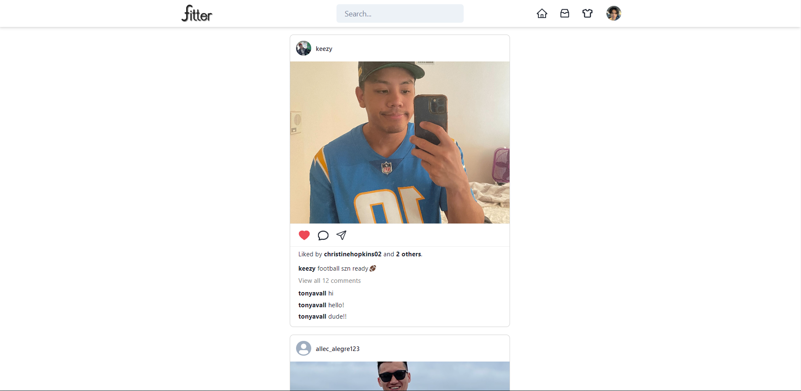
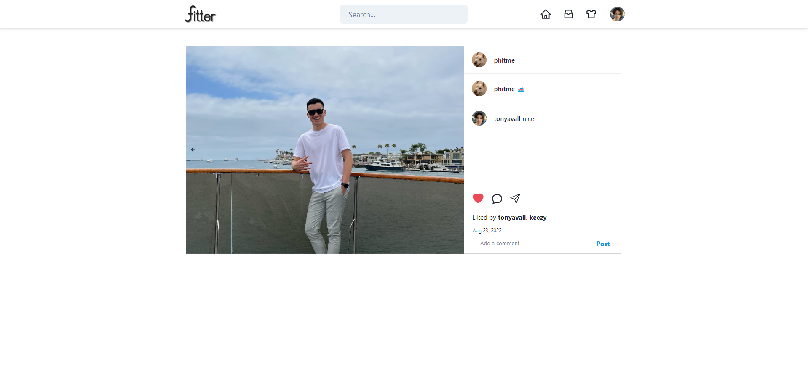
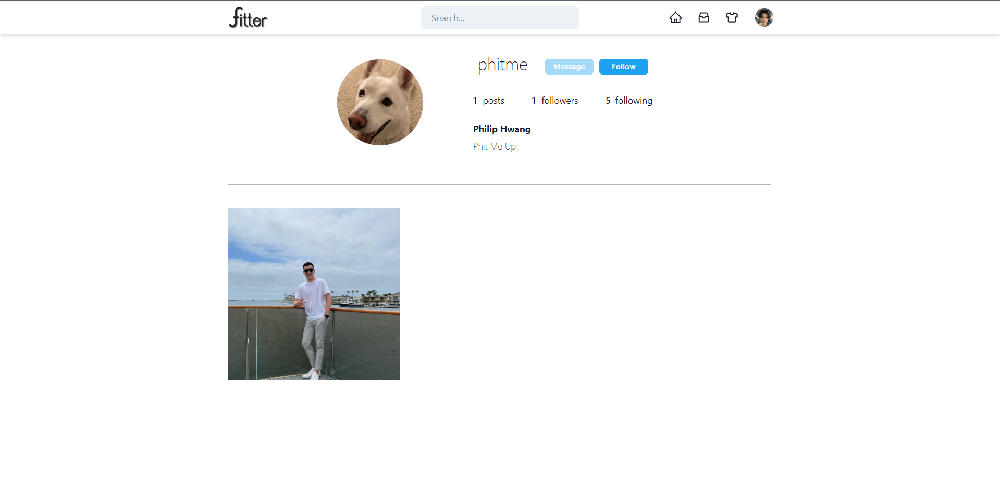
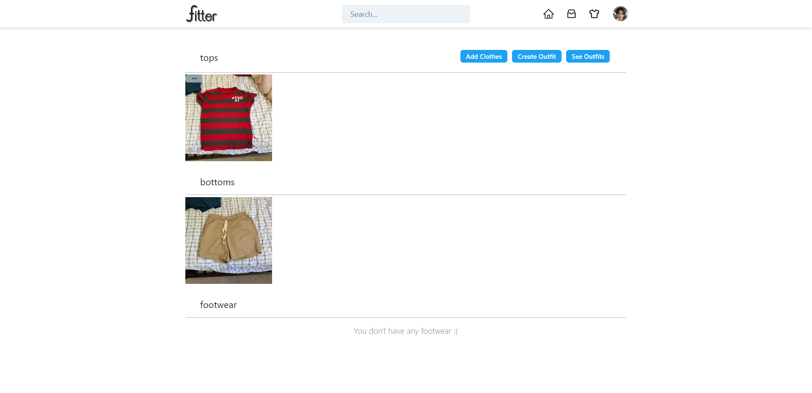

# Fitterapp
Fit up with Fitter!

## Table of Contents
- [Introduction](#introduction)
- [Application Preview](#application-preview)
- [Tech Stack](#tech-stack)
- [Project Notes](#project-notes)
- [Future Implementations](#project-notes)

## Introduction
Fitter is a free social media app that allows users to post pictures of themselves and their respective apparel to their followers.
Users are able to see, comment, and like their following's posted apparel. Apparel comes in 3 types- tops, bottoms, and footwear.
Users have to initially upload these fits to create a whole outfit, by which they can then create a post with that outfit and themselves
wearing it. It is essentially an instagram clone utilizing the benefits of serverside rendering with NEXT, serverless image uploading with S3,
Apollo Graphql as a means for communicating with the NoSQL based backend, and React.
    
## Application Preview

## Tech Stack
Google doc of the documentation can be found [here.](https://docs.google.com/document/d/1GrwYfqg2VBLpDbKqllk1EFciEJIpDuJkf2mt3STRK7k/edit#)
### Frontend
* React
* TypeScript
* NEXTJS
* AWS S3
* GraphQL with Apollo Client
* ChakraUI with ChocUI
* JWT Tokens
* Jotai
* React Cropper
* React Camera
### Backend
* GraphQL with Apollo Server
* NoSQL with MongoDB/Mongoose
* Bcrypt

## Project Notes
### Current Limitations
* React Cropper performance issues for images with higher resolutions.
### Future ASAP Implementations
In no particular order.
* Realtime direct messages through the use of sockets.
* Email authentication.
* Mobile responsiveness and a more intuitive UI.
* Media resolution standardization.
* Expansion of media type, **currently only png and jpg**.
* S3 deletion of objects no longer being used.
### Future Long Term Implementations
* Fitter marketplace with STRIPE api.
* Testing for backend.
* Mobile implementation with React Native.
